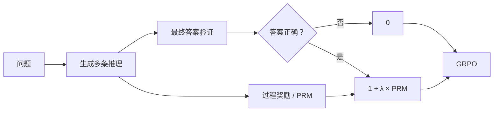

# Process-Supervised RL for Mathematical Reasoning

> 用可验证的最终答案约束数学推理 RL，并以过程奖励区分正确解答中的推理质量。

本项目关注长链数学推理中的两个问题：最终奖励过于稀疏，以及过程奖励可能诱发 reward hacking。工程从 GSM8K 规则奖励原型出发，逐步扩展到 LLM judge、PRM、SFT warmup 和 gated PRM-GRPO。


## 方法

最终答案是硬约束；过程奖励只用于排序答对的候选：

```python
if final_answer_correct:
    reward = 1.0 + 0.2 * process_reward
else:
    reward = 0.0
```

这样，模型不能通过冗长或表面合理的过程为错误答案获取正反馈。



## 已完成工作

- **数据管线**：GSM8K 规范化、最终答案抽取、推理步骤切分与 debug subset 构造。
- **奖励建模**：final reward、规则过程 reward、anti-hacking penalty、候选 reranking 与 Python verifier。
- **过程监督数据闭环**：多候选生成、LLM judge、preference 数据构造、轻量 PRM 训练与诊断。
- **训练路径**：LoRA SFT、Skywork PRM 接入、warmup adapter merge、fresh LoRA gated GRPO。
- **工程质量**：数据、reward、PRM、训练入口和 CLI 均有单元测试；大模型资产与完整数据不提交 Git。

当前主线：

```text
deepseek-math-7b-instruct
  + MATH Level 3/4 SFT warmup
  -> merge warmup adapter
  + fresh r512 LoRA
  -> gated PRM-GRPO
```

## 路线演进：为什么不是直接训练一个 PRM

这不是一条预先设定好的直线流程，而是由每轮诊断结果推动的迭代。

| 阶段 | 实际做法 | 发现的问题 | 因此做出的决策 |
| --- | --- | --- | --- |
| 1. 规则原型 | 在 GSM8K 上按换行切分 reasoning，设计 validity / consistency / progress / anti-hacking 规则 reward | 规则可运行，但“按行”不等于语义上独立的推理步骤 | 将规则 reward 限定为 baseline 与 sanity check，不把它包装成 learned PRM |
| 2. 候选 reranking | 对 100 题各生成 4 条候选，比较 final-only 与 final + process | 准确率同为 93%，但过程分与步骤数强负相关（`-0.8478`），有明显短答案偏好 | 继续诊断 reward，不直接用规则分进入 RL |
| 3. LLM judge → 本地偏好模型 | 强 LLM 对同题候选整体排序，生成 324 个 chosen/rejected pairs；训练轻量词袋 preference model | 这是 **trajectory-level / candidate-level** 偏好代理：judge 对整条轨迹判一次，最终压缩为候选级偏好，不能提供可靠的逐 step credit | 不把该模型称为严格 step-level PRM；它只验证数据闭环与 reranking 可行性 |
| 4. 轻量 PRM 诊断 | 轻量模型训练集 pair accuracy 达 0.9722，但与原始 judge 的一致率约 0.71，仍低于 final-only 的 0.74 | 小规模、词袋式偏好模型并没有稳定复现 judge 的过程判断，继续调参收益有限 | 停止投入到“把简化代理调成 PRM”，改为直接接入预训练 Skywork PRM |
| 5. 预训练 PRM + GRPO | 用 Skywork 的 Qwen reward head 取得 step rewards，在 MATH L3/4 warmup 后进行 gated GRPO | 早期 additive reward 会让错误答案因过程分获得正奖励；小 rank / 200-step 训练也太弱 | 改为 final-correctness gate、fresh r512 LoRA、1000-step 配置，并引入 dynamic sampling |

这里的术语边界很重要：早期本地“PRM”并不是严格的过程奖励模型。它没有对每个语义推理步骤提供独立、可靠的标签；实际信号来自 LLM judge 对**整条候选轨迹**的相对排序，再被压缩成一个候选级偏好或总体分数。这个退化代理适合验证工程闭环，却不足以承担细粒度 credit assignment。

后续接入 Skywork PRM 的原因正是如此：它提供真正的 token / step reward 序列。即便如此，数学题的最终答案仍由 verifier 硬门控；PRM 只负责在正确候选内部提供过程质量信号。

相关阶段记录：[step1：工程与规则原型](docs/history/README_process_supervised_rl_step1.md) · [step2：reranking 与规则偏差](docs/history/README_process_supervised_rl_step2.md) · [step3：LLM judge 与轻量偏好模型](docs/history/README_process_supervised_rl_step3.md) · [step4：Skywork PRM 与 gated GRPO](docs/history/README_process_supervised_rl_step4.md)

## 探索性结果


三组均使用相同的模型、MATH L3/4 warmup、gated PRM reward、MATH500 first-100、greedy decoding 和 seed 42；Dynamic Sampling GRPO 的准确率为 49/100。完整指标与来源见 [结果表](docs/evidence/math500_exploratory_ablation.csv)。

这是 single-seed 的训练策略探索，**不是正式 benchmark，也不能证明过程奖励单独带来提升**：目前尚未归档同设定的 `final-only GRPO` 控制组。

训练日志也保留了 Dynamic-Sampling run 的 loss、reward 和最终正确率；由于其在 step 500 后以 weights-only 方式恢复，图中将两段训练分开呈现。


早期 GSM8K reranking 诊断则覆盖 100 题、400 条候选：final-only 与 final + process 的 top-1 准确率均为 93%，后者改变了 50 个选择且没有 `1→0` 退化；同时发现过程分与步骤数存在较强负相关，因而没有直接将其当作训练结论。[查看原始报告](docs/evidence/gsm8k_reranking_100_report.md)

## 快速开始

```bash
# 轻量工程验证
pytest -q

# 准备 GSM8K
python scripts/prepare_gsm8k.py \
  --input data/raw/train.jsonl \
  --output data/processed/gsm8k_train.jsonl \
  --split train

# 准备 MATH L3/4 训练子集
python scripts/prepare_math_l34.py \
  --output data/processed/math_l34_train_3000_seed42.jsonl \
  --limit 3000 \
  --seed 42
```

完整 SFT、PRM、GRPO 命令与模型加载要求见 [复现流程](docs/repro/current_pipeline.md)。评测 GRPO 时必须加载：

```text
base + merged warmup SFT adapter + r512 GRPO adapter
```

## 项目结构

```text
src/psrl/     data、reward、PRM、GRPO 与评测核心逻辑
scripts/      数据准备、候选生成、judge、PRM、SFT、GRPO、benchmark 入口
configs/      数据、reward、训练与评测配置
tests/        单元测试与 CLI smoke tests
docs/         设计、阶段记录与复现说明
```

更多背景与实验决策：
[设计文档](docs/superpowers/specs/2026-04-19-process-supervised-rl-design.md) ·
[阶段记录](docs/history/README_process_supervised_rl_step4.md) ·
[复现流程](docs/repro/current_pipeline.md)

## Next

- 完成 final-only GRPO vs. gated PRM-GRPO 的同设定、多 seed 对照；
- 在 MATH500 full 上评测，并归档曲线、逐题预测和可复用结果表。
