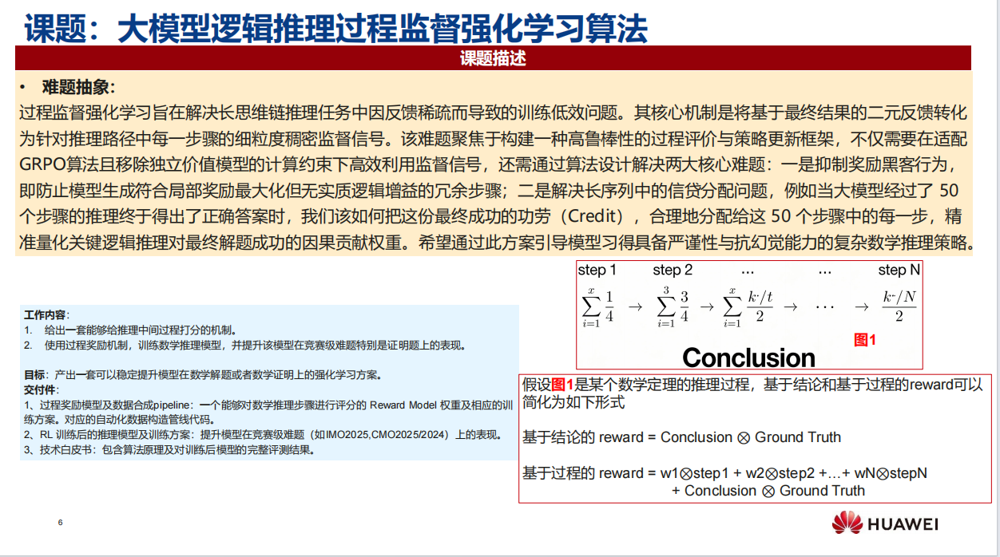
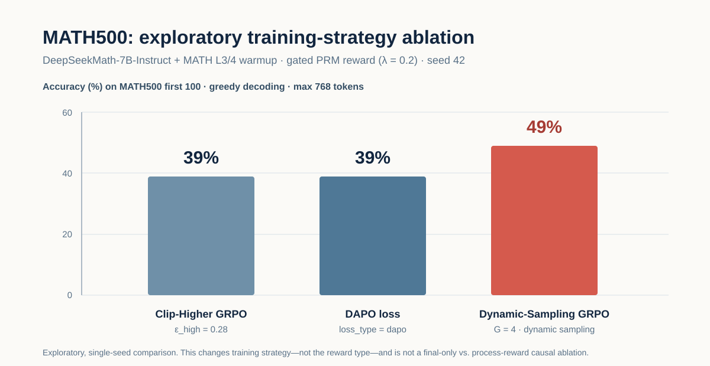
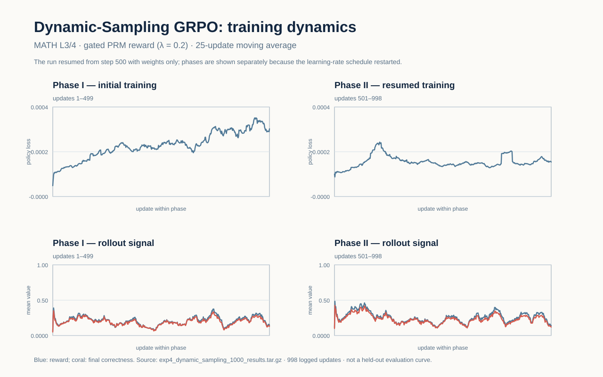

# Process-Supervised RL for Mathematical Reasoning

> 用可验证的最终答案约束数学推理 RL，并以过程奖励区分正确解答中的推理质量。

本项目关注长链数学推理中的两个问题：最终奖励过于稀疏，以及过程奖励可能诱发 reward hacking。工程从 GSM8K 规则奖励原型出发，逐步扩展到 LLM judge、PRM、SFT warmup 和 gated PRM-GRPO。



## 方法

最终答案是硬约束；过程奖励只用于排序答对的候选：

```python
if final_answer_correct:
    reward = 1.0 + 0.2 * process_reward
else:
    reward = 0.0
```

## 已完成工作

- **数据管线**：GSM8K 规范化、最终答案抽取、推理步骤切分与 debug subset 构造。
- **奖励建模**：final reward、规则过程 reward、anti-hacking penalty、候选 reranking 与 Python verifier。
- **过程监督数据**：多候选生成、LLM judge、preference 数据构造、轻量 PRM 训练与诊断。
- **训练路径**：LoRA SFT、Skywork PRM 接入、warmup adapter merge、fresh LoRA gated GRPO。
- **工程质量**：数据、reward、PRM、训练入口和 CLI 均有单元测试；大模型资产与完整数据不提交 Git。

当前主线：

```text
deepseek-math-7b-instruct
  + MATH Level 3/4 SFT warmup
  -> merge warmup adapter
  + fresh r512 LoRA
  -> gated PRM-GRPO
```

## 路线演进


** 1. 用规则代替reward model打分第一版，具体有下面四个标准

$$
\hat R_{\mathrm{rule}}=\operatorname{norm}\!\left(\frac{1}{T}\sum_t
  [r_{\mathrm{valid}}+r_{\mathrm{consistent}}+r_{\mathrm{progress}}-0.5r_{\mathrm{hack}}]\right).
$$

其中 `validity` 看数字和运算，`consistency` 查变量赋值冲突，`progress` 看是否引入新的数值/推导，`anti-hacking` 查重复、空泛 filler、提示词或代码污染。

问题：第一，换行只是文本格式：一行可能把两步推理也可能两行是一步推理过程，所以它不是可标注的语义步骤。第二，步骤和步骤之间有关系 ，规则会奖励它容易数到的表面特征，而非真正的推理质量。

我没有凭直觉继续调权重，而是在 100 题 × 4 候选的同一批轨迹上做 reranking。`final-only` 与 `final + rule-process` 的 top-1 都是 **93%**，但出现了

$$
\operatorname{corr}(\texttt{num\_steps},\ \texttt{process\_reward})=-0.8478.
$$

也就是说，过程分与推理长度强烈负相关，明显偏爱短轨迹；50/100 道题虽换了选择，却没有带来准确率增益。个人认为很可能是长回答后续步骤引入新数值少得分低

**2. 考虑到推理链条其实有很强的上下文联系关系先让 LLM 从全局视角评一次，类LLM judge。** 改为将同一题的 4 条完整候选连同题目和参考答案交给强 LLM judge。它一次看到整条推理，能比较跳步、前后矛盾、无关展开和最终结论之间的关系；每题输出候选排序**324 个** `chosen/rejected` preference pairs。
目的是用这些偏好数据训练一个打分的小模型，==但是后续实验很不理想很明显==，第一数据量太小

实际诊断也验证了这一点：轻量模型在这 324 个训练 pair 上的 accuracy 达到 **0.9722**，但在候选选择评估中，它与原始 LLM judge 选中结果的一致率只有约 **0.71**。具体地说，同一道题的 4 条完整 CoT 都会被小模型各自打一个**轨迹总分**，模型选最高分的那条；约 71% 的题目中，这一选择与 judge 的 top-1 相同。它不是最终答案准确率，更不是逐 step 打分准确率。

`final-only` 的 judge 一致率不在这里作为过程质量基线比较：它只按最终答案选择候选，而 judge 也会重视最终正确性，两者衡量的能力不同。原因不只是数量小：这些 pair 只来自 100 道题的候选排序，覆盖的错误类型有限；更关键的是，每个标签评价的是整条 CoT 的相对好坏，无法告诉模型“具体哪一步错了、该扣多少分”。因此小模型很容易拟合训练样本中的长度、措辞等表面模式，却难以稳定复现 judge 的全局判断。

所以后续没有继续用这几百条数据从零训练或硬调这个小模型，而是直接接入已经在大规模过程监督数据上预训练的 Skywork PRM，把有限的实验资源用在验证最终答案门控、reward 设计和 GRPO 训练策略上。

**3. 用外部 judge 而不是训练集分数检验这个退化代理。** 轻量模型在 324 个训练 pair 上达到 **0.9722** accuracy，看起来很好；但在候选选择评估中，与原 LLM judge 的 top-1 一致率只有约 **0.71**。这说明训练集拟合高，并不等于能稳定复现 judge 对完整推理轨迹的偏好。训练集拟合与外部对齐之间存在落差，继续把它硬调成“PRM”的证据不够；它完成了验证数据闭环的任务，但不承担细粒度 credit assignment。

**4. 接入预训练 Skywork PRM（1.5B），但仍只评整条 CoT。** 为避免用 324 个 pair 从零训练过程模型，后续改用预训练的 Skywork PRM。当前用法是把“题目 + 完整 CoT”整体输入模型，得到一个 `raw_prm_score`；GRPO 对每条轨迹只接收这一个标量过程分。不做语义步骤切分，也不对单独某一步打分或更新。随后在 MATH L3/4 warmup 后进行 GRPO。

训练中还发现：若直接使用 $R=R_{\mathrm{final}}+\lambda R_{\mathrm{process}}$，错误答案仍可能凭借“看起来像好过程”得到正奖励，这会把 reward hacking 带回训练。因此最终采用

$$
R(x,y)=
\begin{cases}
1+0.2\,R_{\mathrm{PRM}}(x,y), & \text{final answer correct},\\
0, & \text{otherwise}.
\end{cases}
$$

并使用 fresh r512 LoRA、1000-step 配置与 dynamic sampling。最终答案是不可绕过的验证门；PRM 只在答对的候选之间分配过程 credit。这是当前项目对“既要过程监督、又要抑制 reward hacking”的实际折中，而不是声称已经解决了严格逐步标注的问题。

相关阶段记录：[step1：工程与规则原型](docs/history/README_process_supervised_rl_step1.md) · [step2：reranking 与规则偏差](docs/history/README_process_supervised_rl_step2.md) · [step3：LLM judge 与轻量偏好模型](docs/history/README_process_supervised_rl_step3.md) · [step4：Skywork PRM 与 gated GRPO](docs/history/README_process_supervised_rl_step4.md)

## 探索性结果



三组均使用相同的模型、MATH L3/4 warmup、gated PRM reward、MATH500 first-100、greedy decoding 和 seed 42；Dynamic Sampling GRPO 的准确率为 49/100。完整指标与来源见 [结果表](docs/evidence/math500_exploratory_ablation.csv)。

这是 single-seed 的训练策略探索，**不是正式 benchmark，也不能证明过程奖励单独带来提升**：目前尚未归档同设定的 `final-only GRPO` 控制组。

训练日志也保留了 Dynamic-Sampling run 的 loss、reward 和最终正确率；由于其在 step 500 后以 weights-only 方式恢复，图中将两段训练分开呈现。



早期 GSM8K reranking 诊断则覆盖 100 题、400 条候选：final-only 与 final + process 的 top-1 准确率均为 93%，后者改变了 50 个选择且没有 `1→0` 退化；同时发现过程分与步骤数存在较强负相关，因而没有直接将其当作训练结论。[查看原始报告](docs/evidence/gsm8k_reranking_100_report.md)

## 快速开始

```bash
# 轻量工程验证
pytest -q

# 准备 GSM8K
python scripts/prepare_gsm8k.py \
  --input data/raw/train.jsonl \
  --output data/processed/gsm8k_train.jsonl \
  --split train

# 准备 MATH L3/4 训练子集
python scripts/prepare_math_l34.py \
  --output data/processed/math_l34_train_3000_seed42.jsonl \
  --limit 3000 \
  --seed 42
```

完整 SFT、PRM、GRPO 命令与模型加载要求见 [复现流程](docs/repro/current_pipeline.md)。评测 GRPO 时必须加载：

```text
base + merged warmup SFT adapter + r512 GRPO adapter
```

## 项目结构

```text
src/psrl/     data、reward、PRM、GRPO 与评测核心逻辑
scripts/      数据准备、候选生成、judge、PRM、SFT、GRPO、benchmark 入口
configs/      数据、reward、训练与评测配置
tests/        单元测试与 CLI smoke tests
docs/         设计、阶段记录与复现说明
```

更多背景与实验决策：
[设计文档](docs/superpowers/specs/2026-04-19-process-supervised-rl-design.md) ·
[阶段记录](docs/history/README_process_supervised_rl_step4.md) ·
[复现流程](docs/repro/current_pipeline.md)

## Next

- 完成 final-only GRPO vs. gated PRM-GRPO 的同设定、多 seed 对照；
- 在 MATH500 full 上评测，并归档曲线、逐题预测和可复用结果表。
